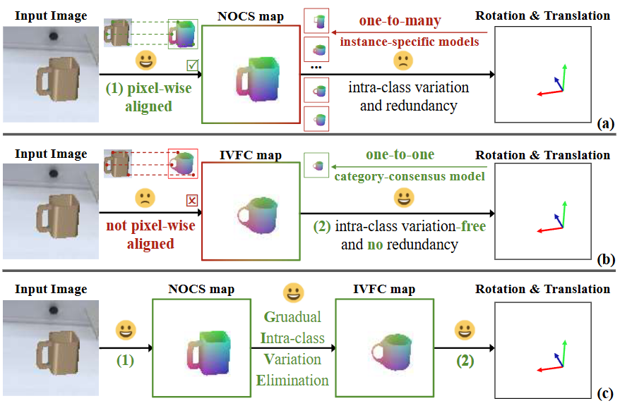
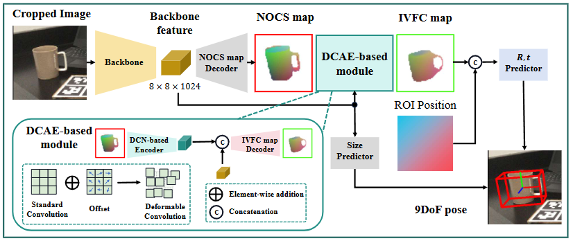

# GIVEPose

#### Pytorch implementation of GIVEPose:Gradual Intra-class Variation Elimination for RGB-based Category-Level Object Pose Estimation[[paper](https://arxiv.org/pdf/2503.15110)].

<div align=center>

</div>

Our proposed gradual intra-class variation elimination strategy leverages the complementary 
advantages of both maps, enabling more precise category-level pose estimation.

## Framework of our method:


## Installation

To install the required dependencies, use the following commands:

```bash
conda env create -f GIVEPose_env.yaml
```
(Optional) You may also want to install [xformers](https://github.com/facebookresearch/xformers) for efficient transformer implementation:

```
pip install xformers==0.0.16
```

## Get Started

### Prepare the data

Our implementation leverages the code from [Lapose](https://github.com/lolrudy/LaPose). 
Following the [Data Preparation](https://github.com/lolrudy/LaPose?tab=readme-ov-file#data-preparation) in the Lapose repository, 
you can download the NOCS dataset and preprocess it.
* For the IVFC map used in the training stage, you can download the map from [here](https://drive.google.com/file/d/1q4zqJWqYKv0zJJY_lK_3YZzY0X-9xJ1Z/view?usp=sharing).
* For the Wild6D dataset, you can download the dataset from [here](https://github.com/OasisYang/Wild6D).
* Put NOCS, IVFC and Wild6D dataset in the `data` folder.

## Train

* Train on the CAMERA+Real dataset.

```bash
python engine/train.py --model_save="./output/model_save"
```

* Train on the CAMERA dataset.

```bash
python engine/train.py  --model_save="./output/model_save_C" --dataset=CAMERA
```

## Evaluate
Our model checkpoint for evaluation cam be found [here](). (We use the scale net provided by [Lapose](https://github.com/lolrudy/LaPose?tab=readme-ov-file#evaluate)).

* Evaluate on the Real dataset. 

```bash
python evaluation/evaluate.py --resume_model="./path/to/pose_net/xxx.pth" --dataset=Real --use_scale_net --sn_path='./path/to/scale_net/xxx.pth'
```

* Evaluate on the Wild6D dataset. 

```bash
python evaluation/evaluate.py --resume_model="./path/to/pose_net/xxx.pth" --dataset=wild6d --use_scale_net --sn_path='./path/to/scale_net/xxx.pth'
```

* Evaluate on the CAMERA dataset.

```bash
python evaluation/evaluate.py --resume_model="./path/to/pose_net_C/xxx.pth" --dataset=CAMERA --use_scale_net --sn_path='./path/to/scale_net_C/xxx.pth'
```

## Citation

If you find our work useful, please cite:

```BibTeX
@InProceedings{huang_2025_GIVEPose,
title = {GIVEPose: Gradual Intra-class Variation Elimination for RGB-based Category-Level Object Pose Estimation},
author = {Huang, Zinqin and Wang, Gu and Zhang, Chenyangguang and Zhang, Ruida and Li, Xiu and Ji, Xiangyang},
booktitle = {CVPR},
month = {June},
year  = {2025},
}
```